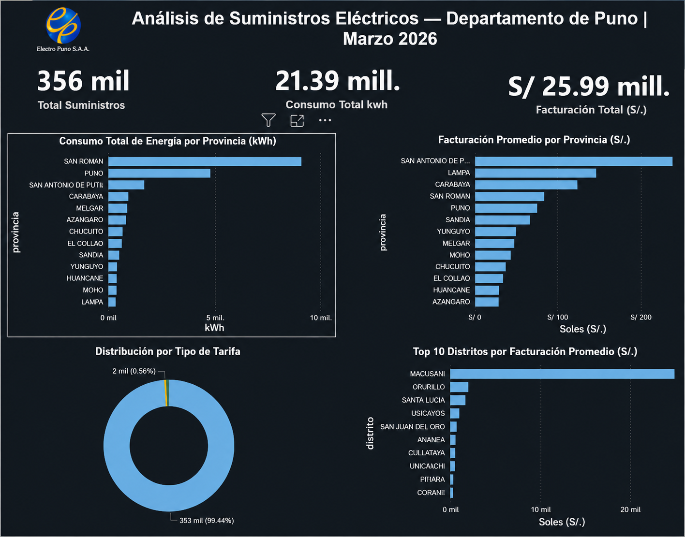

# ⚡ Análisis de Suministros Eléctricos — Departamento de Puno | Marzo 2026




## 📌 Descripción

Análisis exploratorio de 357,000 registros de suministros eléctricos del departamento de Puno, Perú. Los datos fueron extraídos de la **Plataforma Nacional de Datos Abiertos del Perú** ([datos.gob.pe](https://www.datosabiertos.gob.pe/)) y corresponden al período de Marzo 2026.

El objetivo del proyecto fue identificar patrones de consumo y facturación eléctrica a nivel provincial y distrital, diferenciando entre clientes residenciales e industriales.

---

## 🗂️ Estructura del proyecto

```
Analisis-Energia-Puno/
│
├── 01_analisis.sql          # Consultas exploratorias y análisis de datos
├── 02_vistas.sql            # Vistas de PostgreSQL para alimentar el dashboard
├── dashboard_energia_puno.pbix  # Dashboard interactivo en Power BI
└── README.md
```

---

## 🔍 Proceso de análisis

### 1. Carga de datos
- Se importaron 357,497 registros desde un archivo CSV a PostgreSQL usando el comando `\copy`
- Se identificó y corrigió un BOM (Byte Order Mark) en el archivo original

### 2. Exploración y limpieza
- Se identificaron **61,772 registros con consumo en cero** (clientes sin consumo ese mes)
- Se identificaron **22 registros con monto negativo** (notas de crédito) que fueron excluidos del análisis
- Se verificó que no existieran consumos negativos

### 3. Análisis SQL
Se construyeron consultas para responder las siguientes preguntas:
- ¿Qué provincias concentran más suministros y mayor consumo?
- ¿Cuánto consume y factura en promedio cada provincia?
- ¿Qué tipo de tarifa predomina en la región?
- ¿Qué distritos tienen la mayor facturación promedio por cliente?

### 4. Visualización
Se crearon 4 vistas en PostgreSQL y se conectaron directamente a Power BI para construir el dashboard.

---

## 📊 Hallazgos principales

| Indicador | Valor |
|---|---|
| Total de suministros activos | 356,174 |
| Consumo total | 21.39 millones de kWh |
| Facturación total | S/. 25.99 millones |

- **San Román** concentra el mayor consumo eléctrico de la región con más de 9 millones de kWh, impulsado por la ciudad de Juliaca
- **San Antonio de Putina** lidera en facturación promedio por cliente (S/. 236 vs S/. 83 del promedio regional), señal de actividad industrial y minera
- El **99% de los suministros** corresponden a la tarifa BT5B (residencial), lo que revela que Puno es una región predominantemente doméstica
- El distrito de **Macusani** (Carabaya) tiene solo 12 clientes pero con una facturación promedio de S/. 24,760 al mes, confirmando la presencia de minería pesada en la zona

---

## 🛠️ Herramientas utilizadas

- **PostgreSQL** — almacenamiento, limpieza y análisis de datos
- **VSCode** — escritura y ejecución de consultas SQL
- **Power BI Desktop** — visualización y dashboard
- **WSL Ubuntu** — entorno de trabajo en Linux sobre Windows

---

## 🚀 Cómo reproducir el proyecto

1. Descarga el dataset desde [datos.gob.pe](https://www.datosabiertos.gob.pe/)
2. Crea una base de datos en PostgreSQL llamada `energia_puno`
3. Ejecuta `01_analisis.sql` para explorar los datos
4. Ejecuta `02_vistas.sql` para crear las vistas
5. Abre `dashboard_energia_puno.pbix` en Power BI Desktop y conecta a tu instancia de PostgreSQL

---

## 👨‍💻 Autor

**Eduardo Díaz**  
Analista de datos en formación | Autodidacta  
[LinkedIn](https://www.linkedin.com/in/eduardiazcode) · [GitHub](https://github.com/eduardiazcode)

---

> *Este es mi primer proyecto de análisis de datos con datos reales. Construido con el objetivo de practicar SQL y Power BI aplicados a un problema concreto.*